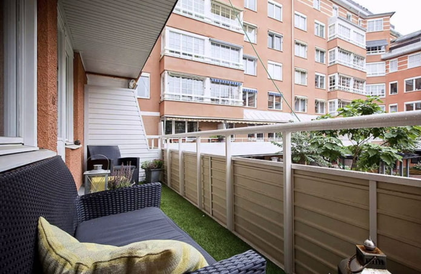
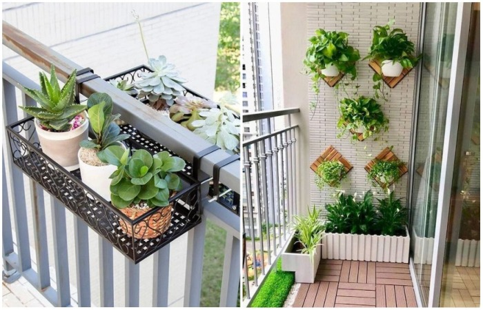
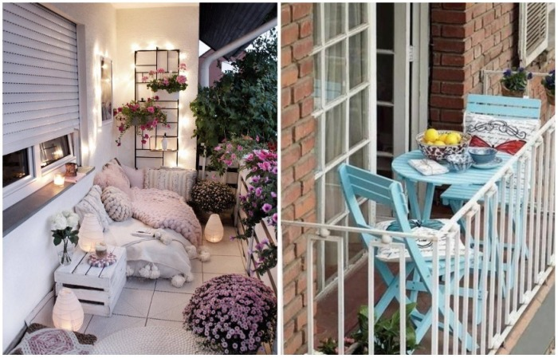
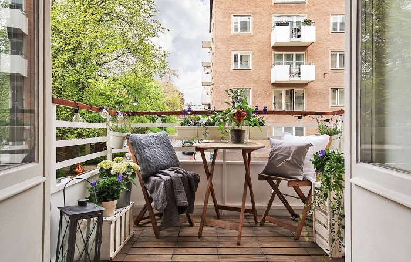

# 3 ideas how to arrange an outdoor balcony to turn it into a corner of paradise

Making an outdoor balcony beautiful and functional is not as easy as it seems at first glance. You need to take into account many nuances regarding design, but most importantly - you need to decide how exactly you are going to use this area. Novate.ru offers a few interesting and stylish ideas to help turn your balcony into a corner of paradise, rather than a warehouse for old things.

## Idea 1: Green Corner

If the side is not sunny, in the spring on an outdoor balcony you can take the plants that previously stood in the apartment on the windowsill. Dreaming of something fast-growing? Consider annuals: you can sow peas or morning glory. Ready for a more serious plant? Then perennials are just what the doctor ordered. This could be ivy, maidenhair grapes, clematis. If you make an effort, in a few years you can turn your balcony into a paradise, full of verdure, not worse than in Europe.

Use multi-storey stands for planters. Another option is to make shelves at the end of your balcony. Do not forget about the possibilities of the railing - tubs with flowers will look great on them. For housewives with apartments on high floors pots and planters should be placed so that they look into the balcony - passers-by won't appreciate that beauty anyway. Instead of decorative plants you can grow fresh herbs for salad - in this way the mini-garden will turn into a mini-garden.

On a side note: If you are not friendly with the earth - this is not a reason to get upset. You can use the "gifts of nature" in assembled form to decorate your balcony. We are talking about a bouquet of fresh flowers or a still life of fruits and vegetables, which can be placed anywhere.

## Idea 2: A seating and reading area

Given the fact that this year spring is in no hurry to come in our area and summer is not expected to be too hot, we need to appreciate every warm evening. We suggest that you don't waste this wonderful time and arrange a suitable area for outdoor recreation.

The best news is that you don't need to put a lot of effort into it. All you will need is a bench or chair, a plaid and some comfortable cushions. If there's room, make sure you have a small coffee table on the balcony - you'll find it's nice to sit on a soft armchair with your favourite book in one hand and a cup of aromatic marshmallow cocoa in the other.

## Idea 3: A place for breakfast and tea parties

What could be more beautiful in the warm season than delightful breakfasts on the balcony and cozy evening tea parties outdoors? If you agree with us, it's time to set up a special area that's perfect for this purpose.

